# Architecture Documentation

This document provides visual architecture diagrams and explanations of the JengaHacks 2026 system architecture.

## Table of Contents

- [System Overview](#system-overview)
- [Component Architecture](#component-architecture)
- [Registration Flow](#registration-flow)
- [Data Flow](#data-flow)
- [Security Architecture](#security-architecture)
- [Deployment Architecture](#deployment-architecture)
- [Technology Stack](#technology-stack)

## System Overview

### High-Level Architecture

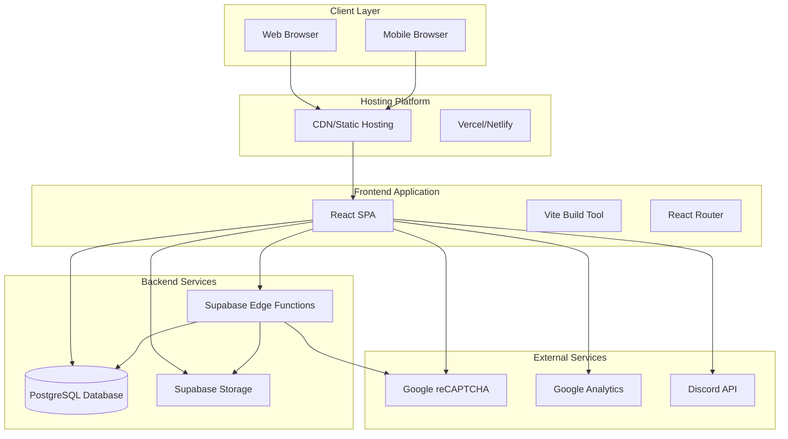
```mermaid
graph TB
    subgraph "Client Layer"
        Browser[Web Browser]
        Mobile[Mobile Browser]
    end
    
    subgraph "Frontend Application"
        React[React SPA]
        Vite[Vite Build Tool]
        Router[React Router]
    end
    
    subgraph "Hosting Platform"
        CDN[CDN/Static Hosting]
        Vercel[Vercel/Netlify]
    end
    
    subgraph "Backend Services"
        EdgeFunctions[Supabase Edge Functions]
        Database[(PostgreSQL Database)]
        Storage[Supabase Storage]
    end
    
    subgraph "External Services"
        reCAPTCHA[Google reCAPTCHA]
        Analytics[Google Analytics]
        Discord[Discord API]
    end
    
    Browser --> CDN
    Mobile --> CDN
    CDN --> React
    React --> EdgeFunctions
    React --> Database
    React --> Storage
    React --> reCAPTCHA
    React --> Analytics
    React --> Discord
    EdgeFunctions --> Database
    EdgeFunctions --> Storage
    EdgeFunctions --> reCAPTCHA
```

**Key Components:**
- **Client Layer:** Web and mobile browsers accessing the application
- **Frontend:** React SPA built with Vite, served via CDN
- **Backend:** Supabase Edge Functions for server-side logic
- **Database:** PostgreSQL with Row Level Security (RLS)
- **Storage:** Private bucket for resume files
- **External:** reCAPTCHA, Analytics, and Discord integration

---

## Component Architecture

### Frontend Component Structure

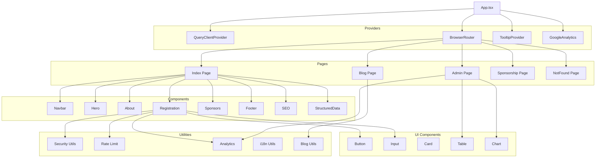
```mermaid
graph TD
    App[App.tsx]
    
    subgraph "Providers"
        QueryClient[QueryClientProvider]
        Router[BrowserRouter]
        Tooltip[TooltipProvider]
        Analytics[GoogleAnalytics]
    end
    
    subgraph "Pages"
        Index[Index Page]
        Blog[Blog Page]
        Admin[Admin Page]
        Sponsorship[Sponsorship Page]
        NotFound[NotFound Page]
    end
    
    subgraph "Components"
        Navbar[Navbar]
        Hero[Hero]
        About[About]
        Registration[Registration]
        Sponsors[Sponsors]
        Footer[Footer]
        SEO[SEO]
        StructuredData[StructuredData]
    end
    
    subgraph "UI Components"
        Button[Button]
        Input[Input]
        Card[Card]
        Table[Table]
        Chart[Chart]
    end
    
    subgraph "Utilities"
        Security[Security Utils]
        RateLimit[Rate Limit]
        AnalyticsLib[Analytics]
        I18n[i18n Utils]
        BlogLib[Blog Utils]
    end
    
    App --> QueryClient
    App --> Router
    App --> Tooltip
    App --> Analytics
    
    Router --> Index
    Router --> Blog
    Router --> Admin
    Router --> Sponsorship
    Router --> NotFound
    
    Index --> Navbar
    Index --> Hero
    Index --> About
    Index --> Registration
    Index --> Sponsors
    Index --> Footer
    Index --> SEO
    Index --> StructuredData
    
    Registration --> Security
    Registration --> RateLimit
    Registration --> AnalyticsLib
    Admin --> AnalyticsLib
    Blog --> BlogLib
    
    Registration --> Button
    Registration --> Input
    Admin --> Table
    Admin --> Chart
```

**Component Layers:**
1. **App Layer:** Root component with providers
2. **Page Layer:** Route-based page components
3. **Feature Layer:** Business logic components
4. **UI Layer:** Reusable UI primitives (shadcn/ui)
5. **Utility Layer:** Shared functions and helpers

---

## Registration Flow

### Complete Registration Process

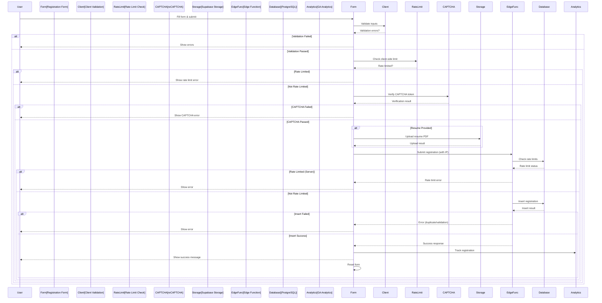
```mermaid
sequenceDiagram
    participant User
    participant Form[Registration Form]
    participant Client[Client Validation]
    participant RateLimit[Rate Limit Check]
    participant CAPTCHA[reCAPTCHA]
    participant Storage[Supabase Storage]
    participant EdgeFunc[Edge Function]
    participant Database[(PostgreSQL)]
    participant Analytics[GA Analytics]
    
    User->>Form: Fill form & submit
    Form->>Client: Validate inputs
    Client-->>Form: Validation errors?
    
    alt Validation Failed
        Form-->>User: Show errors
    else Validation Passed
        Form->>RateLimit: Check client-side limit
        RateLimit-->>Form: Rate limited?
        
        alt Rate Limited
            Form-->>User: Show rate limit error
        else Not Rate Limited
            Form->>CAPTCHA: Verify CAPTCHA token
            CAPTCHA-->>Form: Verification result
            
            alt CAPTCHA Failed
                Form-->>User: Show CAPTCHA error
            else CAPTCHA Passed
                alt Resume Provided
                    Form->>Storage: Upload resume PDF
                    Storage-->>Form: Upload result
                end
                
                Form->>EdgeFunc: Submit registration (with IP)
                EdgeFunc->>Database: Check rate limits
                Database-->>EdgeFunc: Rate limit status
                
                alt Rate Limited (Server)
                    EdgeFunc-->>Form: Rate limit error
                    Form-->>User: Show error
                else Not Rate Limited
                    EdgeFunc->>Database: Insert registration
                    Database-->>EdgeFunc: Insert result
                    
                    alt Insert Failed
                        EdgeFunc-->>Form: Error (duplicate/validation)
                        Form-->>User: Show error
                    else Insert Success
                        EdgeFunc-->>Form: Success response
                        Form->>Analytics: Track registration
                        Form-->>User: Show success message
                        Form->>Form: Reset form
                    end
                end
            end
        end
    end
```

**Flow Steps:**
1. **Client Validation:** Real-time input validation
2. **Rate Limiting:** Client-side check (UX improvement)
3. **CAPTCHA:** Bot protection verification
4. **File Upload:** Resume upload to storage (if provided)
5. **Server Processing:** Edge Function handles IP capture and validation
6. **Database Insert:** Rate-limited insert with RLS policies
7. **Analytics:** Track successful registrations
8. **User Feedback:** Success/error messages

---

## Data Flow

### Registration Data Flow

```mermaid
flowchart LR
    subgraph "Client Side"
        Form[Registration Form]
        Validate[Input Validation]
        Sanitize[Data Sanitization]
        RateCheck[Rate Limit Check]
    end
    
    subgraph "Network"
        HTTPS[HTTPS Request]
    end
    
    subgraph "Edge Function"
        IPCapture[IP Capture]
        ServerValidate[Server Validation]
        RateLimitDB[Database Rate Check]
    end
    
    subgraph "Database"
        RLS[RLS Policies]
        Functions[PostgreSQL Functions]
        Table[(registrations table)]
    end
    
    subgraph "Storage"
        Bucket[resumes bucket]
        File[PDF File]
    end
    
    Form -->|User Input| Validate
    Validate -->|Valid Data| Sanitize
    Sanitize -->|Sanitized| RateCheck
    RateCheck -->|Allowed| HTTPS
    HTTPS -->|POST /register-with-ip| IPCapture
    IPCapture -->|Extract IP| ServerValidate
    ServerValidate -->|Valid| RateLimitDB
    RateLimitDB -->|Check Limits| Functions
    Functions -->|Rate OK| RLS
    RLS -->|Policy Check| Table
    Table -->|Insert| Table
    
    Form -.->|Upload Resume| Bucket
    Bucket -->|Store| File
    File -.->|Path Reference| Table
```

**Data Flow Layers:**
1. **Input Layer:** User form input
2. **Validation Layer:** Client and server validation
3. **Network Layer:** Secure HTTPS transmission
4. **Processing Layer:** Edge Function processing
5. **Storage Layer:** Database and file storage
6. **Security Layer:** RLS policies and rate limiting

---

## Security Architecture

### Multi-Layer Security

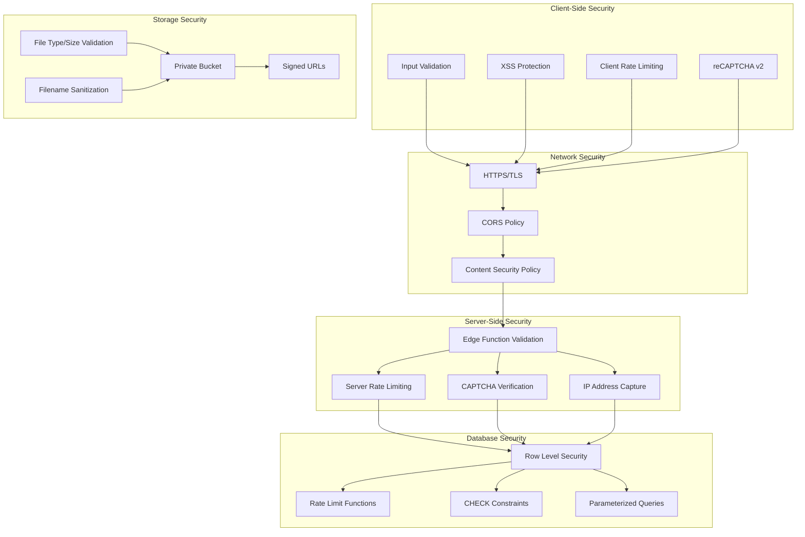
```mermaid
graph TB
    subgraph "Client-Side Security"
        InputValidation[Input Validation]
        XSSProtection[XSS Protection]
        ClientRateLimit[Client Rate Limiting]
        CAPTCHA[reCAPTCHA v2]
    end
    
    subgraph "Network Security"
        HTTPS[HTTPS/TLS]
        CORS[CORS Policy]
        CSP[Content Security Policy]
    end
    
    subgraph "Server-Side Security"
        EdgeFunction[Edge Function Validation]
        ServerRateLimit[Server Rate Limiting]
        IPCapture[IP Address Capture]
        CAPTCHAVerify[CAPTCHA Verification]
    end
    
    subgraph "Database Security"
        RLS[Row Level Security]
        RateLimitFunc[Rate Limit Functions]
        ValidationConstraints[CHECK Constraints]
        PreparedStatements[Parameterized Queries]
    end
    
    subgraph "Storage Security"
        PrivateBucket[Private Bucket]
        SignedURLs[Signed URLs]
        FileValidation[File Type/Size Validation]
        FilenameSanitization[Filename Sanitization]
    end
    
    InputValidation --> HTTPS
    XSSProtection --> HTTPS
    ClientRateLimit --> HTTPS
    CAPTCHA --> HTTPS
    
    HTTPS --> CORS
    CORS --> CSP
    
    CSP --> EdgeFunction
    EdgeFunction --> ServerRateLimit
    EdgeFunction --> IPCapture
    EdgeFunction --> CAPTCHAVerify
    
    ServerRateLimit --> RLS
    CAPTCHAVerify --> RLS
    IPCapture --> RLS
    
    RLS --> RateLimitFunc
    RLS --> ValidationConstraints
    RLS --> PreparedStatements
    
    FileValidation --> PrivateBucket
    FilenameSanitization --> PrivateBucket
    PrivateBucket --> SignedURLs
```

**Security Layers:**
1. **Client:** Input validation, XSS protection, CAPTCHA
2. **Network:** HTTPS encryption, CORS, CSP headers
3. **Server:** Edge Function validation, rate limiting, IP capture
4. **Database:** RLS policies, rate limit functions, constraints
5. **Storage:** Private buckets, signed URLs, file validation

---

## Deployment Architecture

### Production Deployment

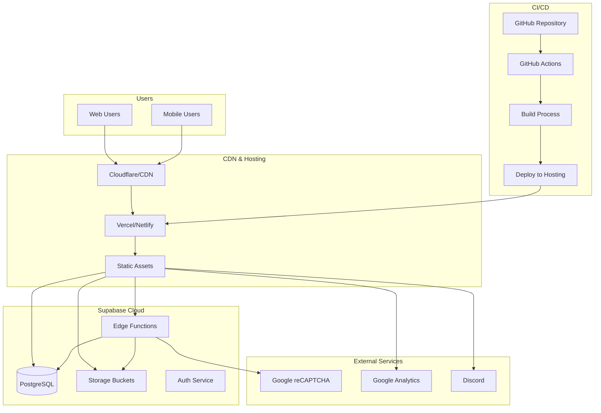
```mermaid
graph TB
    subgraph "Users"
        WebUsers[Web Users]
        MobileUsers[Mobile Users]
    end
    
    subgraph "CDN & Hosting"
        CDN[Cloudflare/CDN]
        Hosting[Vercel/Netlify]
        StaticFiles[Static Assets]
    end
    
    subgraph "Supabase Cloud"
        EdgeFunctions[Edge Functions]
        Database[(PostgreSQL)]
        Storage[Storage Buckets]
        Auth[Auth Service]
    end
    
    subgraph "External Services"
        reCAPTCHA[Google reCAPTCHA]
        Analytics[Google Analytics]
        Discord[Discord]
    end
    
    subgraph "CI/CD"
        GitHub[GitHub Repository]
        Actions[GitHub Actions]
        Build[Build Process]
        Deploy[Deploy to Hosting]
    end
    
    WebUsers --> CDN
    MobileUsers --> CDN
    CDN --> Hosting
    Hosting --> StaticFiles
    
    StaticFiles --> EdgeFunctions
    StaticFiles --> Database
    StaticFiles --> Storage
    
    EdgeFunctions --> Database
    EdgeFunctions --> Storage
    EdgeFunctions --> reCAPTCHA
    
    StaticFiles --> Analytics
    StaticFiles --> Discord
    
    GitHub --> Actions
    Actions --> Build
    Build --> Deploy
    Deploy --> Hosting
```

**Deployment Flow:**
1. **Source:** Code in GitHub repository
2. **CI/CD:** Automated build and test
3. **Build:** Vite production build
4. **Deploy:** Static files to hosting platform
5. **CDN:** Content delivery for performance
6. **Backend:** Supabase services (database, storage, functions)

---

## Technology Stack

### Frontend Stack

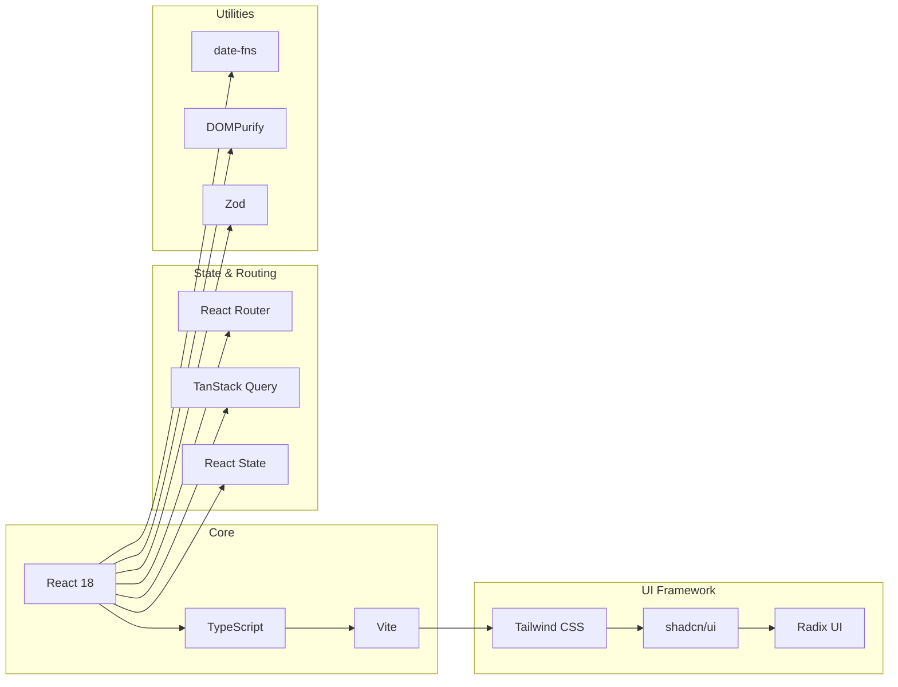
```mermaid
graph LR
    subgraph "Core"
        React[React 18]
        TypeScript[TypeScript]
        Vite[Vite]
    end
    
    subgraph "UI Framework"
        Tailwind[Tailwind CSS]
        Shadcn[shadcn/ui]
        Radix[Radix UI]
    end
    
    subgraph "State & Routing"
        Router[React Router]
        Query[TanStack Query]
        State[React State]
    end
    
    subgraph "Utilities"
        DateFns[date-fns]
        DOMPurify[DOMPurify]
        Zod[Zod]
    end
    
    React --> TypeScript
    TypeScript --> Vite
    Vite --> Tailwind
    Tailwind --> Shadcn
    Shadcn --> Radix
    React --> Router
    React --> Query
    React --> State
    React --> DateFns
    React --> DOMPurify
    React --> Zod
```

### Backend Stack

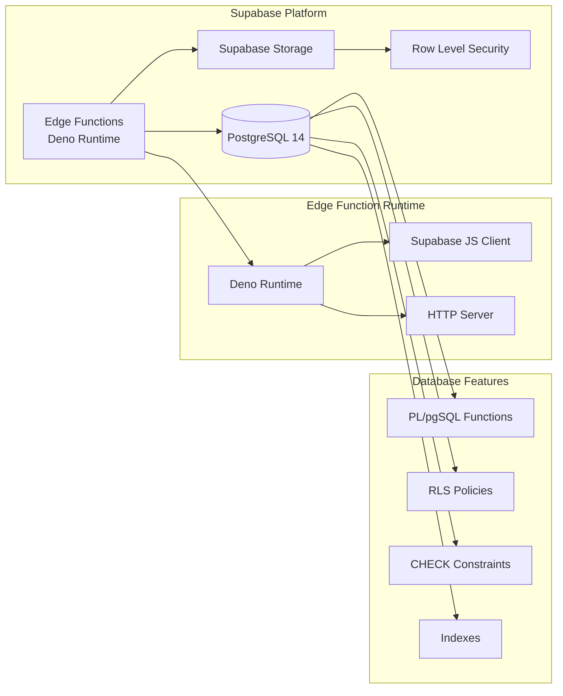
```mermaid
graph LR
    subgraph "Supabase Platform"
        EdgeFunctions[Edge Functions<br/>Deno Runtime]
        PostgreSQL[(PostgreSQL 14)]
        Storage[Supabase Storage]
        RLS[Row Level Security]
    end
    
    subgraph "Edge Function Runtime"
        Deno[Deno Runtime]
        SupabaseJS[Supabase JS Client]
        HTTP[HTTP Server]
    end
    
    subgraph "Database Features"
        Functions[PL/pgSQL Functions]
        Policies[RLS Policies]
        Constraints[CHECK Constraints]
        Indexes[Indexes]
    end
    
    EdgeFunctions --> Deno
    Deno --> SupabaseJS
    Deno --> HTTP
    EdgeFunctions --> PostgreSQL
    PostgreSQL --> Functions
    PostgreSQL --> Policies
    PostgreSQL --> Constraints
    PostgreSQL --> Indexes
    EdgeFunctions --> Storage
    Storage --> RLS
```

---

## Component Interaction

### Registration Component Dependencies

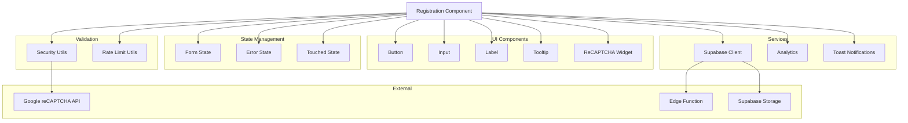
```mermaid
graph TD
    Registration[Registration Component]
    
    subgraph "UI Components"
        Button[Button]
        Input[Input]
        Label[Label]
        Tooltip[Tooltip]
        ReCAPTCHA[ReCAPTCHA Widget]
    end
    
    subgraph "State Management"
        FormState[Form State]
        ErrorState[Error State]
        TouchedState[Touched State]
    end
    
    subgraph "Validation"
        Security[Security Utils]
        RateLimit[Rate Limit Utils]
    end
    
    subgraph "Services"
        Supabase[Supabase Client]
        Analytics[Analytics]
        Toast[Toast Notifications]
    end
    
    subgraph "External"
        GoogleCAPTCHA[Google reCAPTCHA API]
        EdgeFunction[Edge Function]
        Storage[Supabase Storage]
    end
    
    Registration --> Button
    Registration --> Input
    Registration --> Label
    Registration --> Tooltip
    Registration --> ReCAPTCHA
    
    Registration --> FormState
    Registration --> ErrorState
    Registration --> TouchedState
    
    Registration --> Security
    Registration --> RateLimit
    
    Registration --> Supabase
    Registration --> Analytics
    Registration --> Toast
    
    Security --> GoogleCAPTCHA
    Supabase --> EdgeFunction
    Supabase --> Storage
```

---

## Database Schema

### Entity Relationship Diagram

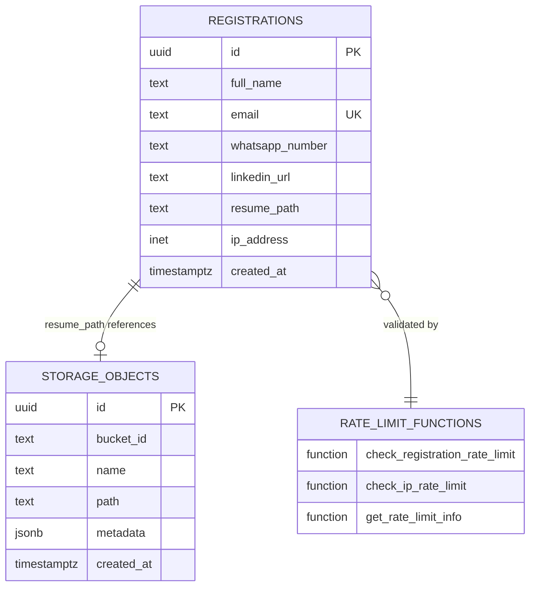
```mermaid
erDiagram
    REGISTRATIONS {
        uuid id PK
        text full_name
        text email UK
        text whatsapp_number
        text linkedin_url
        text resume_path
        inet ip_address
        timestamptz created_at
    }
    
    STORAGE_OBJECTS {
        uuid id PK
        text bucket_id
        text name
        text path
        jsonb metadata
        timestamptz created_at
    }
    
    RATE_LIMIT_FUNCTIONS {
        function check_registration_rate_limit
        function check_ip_rate_limit
        function get_rate_limit_info
    }
    
    REGISTRATIONS ||--o| STORAGE_OBJECTS : "resume_path references"
    REGISTRATIONS }o--|| RATE_LIMIT_FUNCTIONS : "validated by"
```

**Relationships:**
- `registrations.resume_path` references `storage.objects.path`
- Rate limit functions validate registrations before insert
- RLS policies enforce access control

---

## Rate Limiting Architecture

### Multi-Layer Rate Limiting

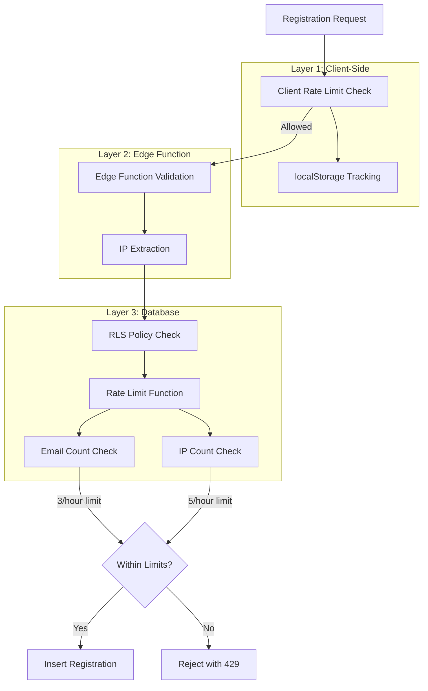
```mermaid
graph TD
    Request[Registration Request]
    
    subgraph "Layer 1: Client-Side"
        ClientCheck[Client Rate Limit Check]
        LocalStorage[localStorage Tracking]
    end
    
    subgraph "Layer 2: Edge Function"
        EdgeCheck[Edge Function Validation]
        IPExtract[IP Extraction]
    end
    
    subgraph "Layer 3: Database"
        RLS[RLS Policy Check]
        RateFunc[Rate Limit Function]
        EmailCheck[Email Count Check]
        IPCheck[IP Count Check]
    end
    
    Request --> ClientCheck
    ClientCheck --> LocalStorage
    
    ClientCheck -->|Allowed| EdgeCheck
    EdgeCheck --> IPExtract
    IPExtract --> RLS
    
    RLS --> RateFunc
    RateFunc --> EmailCheck
    RateFunc --> IPCheck
    
    EmailCheck -->|3/hour limit| Decision{Within Limits?}
    IPCheck -->|5/hour limit| Decision
    
    Decision -->|Yes| Insert[Insert Registration]
    Decision -->|No| Reject[Reject with 429]
```

**Rate Limiting Layers:**
1. **Client:** Immediate UX feedback (can be bypassed)
2. **Edge Function:** Server-side validation and IP capture
3. **Database:** Authoritative rate limiting via RLS and functions

---

## File Upload Flow

### Resume Upload Process

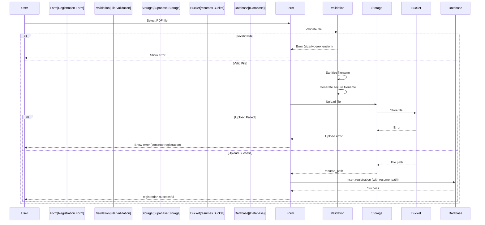
```mermaid
sequenceDiagram
    participant User
    participant Form[Registration Form]
    participant Validation[File Validation]
    participant Storage[Supabase Storage]
    participant Bucket[resumes Bucket]
    participant Database[(Database)]
    
    User->>Form: Select PDF file
    Form->>Validation: Validate file
    
    alt Invalid File
        Validation-->>Form: Error (size/type/extension)
        Form-->>User: Show error
    else Valid File
        Validation->>Validation: Sanitize filename
        Validation->>Validation: Generate secure filename
        
        Form->>Storage: Upload file
        Storage->>Bucket: Store file
        
        alt Upload Failed
            Bucket-->>Storage: Error
            Storage-->>Form: Upload error
            Form-->>User: Show error (continue registration)
        else Upload Success
            Bucket-->>Storage: File path
            Storage-->>Form: resume_path
            
            Form->>Database: Insert registration (with resume_path)
            Database-->>Form: Success
            
            Form-->>User: Registration successful
        end
    end
```

**File Upload Steps:**
1. **Selection:** User selects PDF file
2. **Validation:** Size (5MB), type (PDF), extension (.pdf)
3. **Sanitization:** Filename sanitization and secure naming
4. **Upload:** Upload to private storage bucket
5. **Reference:** Store file path in database
6. **Access:** Admin access via signed URLs

---

## Admin Portal Architecture

### Admin Dashboard Flow

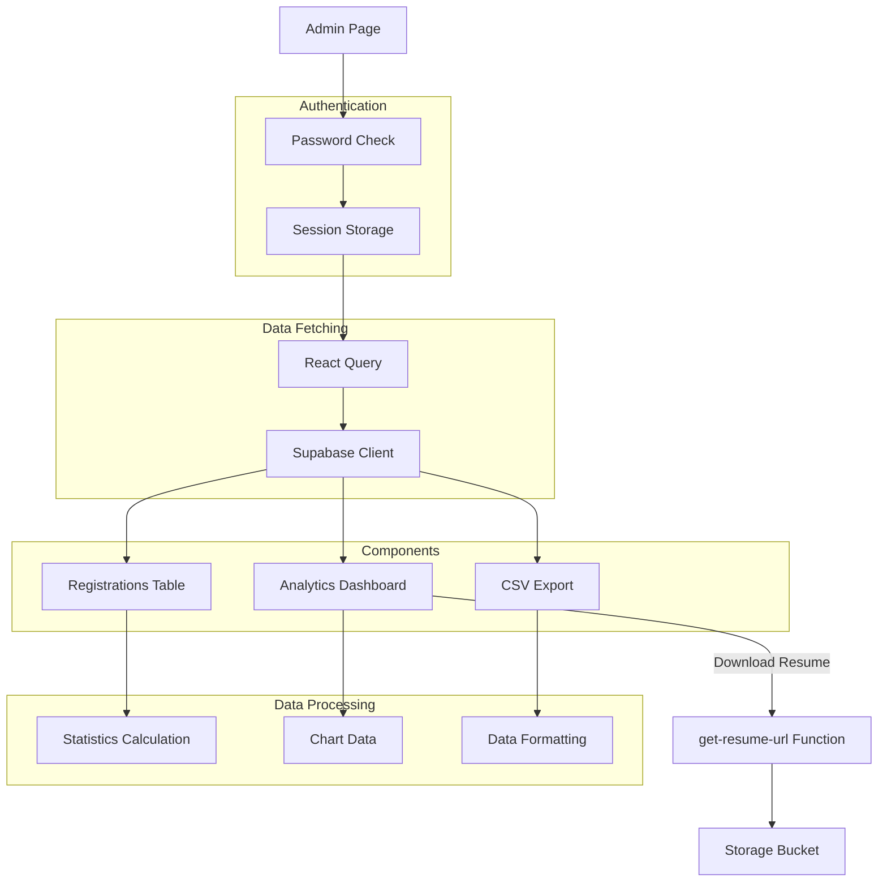
```mermaid
graph TD
    Admin[Admin Page]
    
    subgraph "Authentication"
        Password[Password Check]
        Session[Session Storage]
    end
    
    subgraph "Data Fetching"
        Query[React Query]
        Supabase[Supabase Client]
    end
    
    subgraph "Components"
        Table[Registrations Table]
        Analytics[Analytics Dashboard]
        Export[CSV Export]
    end
    
    subgraph "Data Processing"
        Stats[Statistics Calculation]
        Charts[Chart Data]
        Format[Data Formatting]
    end
    
    Admin --> Password
    Password --> Session
    Session --> Query
    Query --> Supabase
    Supabase --> Table
    Supabase --> Analytics
    Supabase --> Export
    
    Table --> Stats
    Analytics --> Charts
    Export --> Format
    
    Analytics -->|Download Resume| EdgeFunction[get-resume-url Function]
    EdgeFunction --> Storage[Storage Bucket]
```

---

## Internationalization Architecture

### i18n System

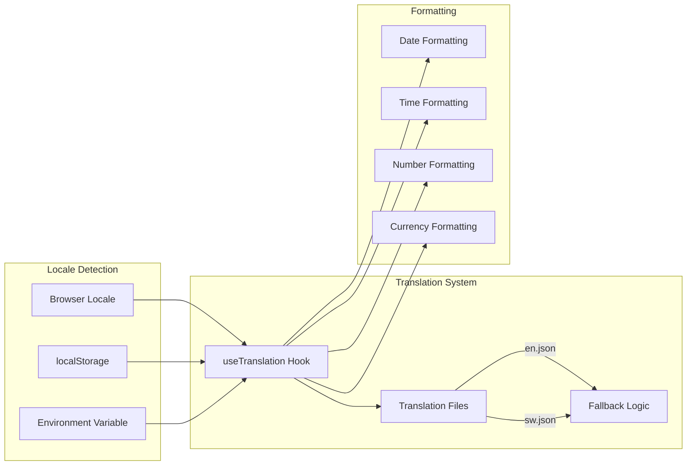
```mermaid
graph LR
    subgraph "Locale Detection"
        Browser[Browser Locale]
        Storage[localStorage]
        Env[Environment Variable]
    end
    
    subgraph "Translation System"
        Hook[useTranslation Hook]
        Files[Translation Files]
        Fallback[Fallback Logic]
    end
    
    subgraph "Formatting"
        Date[Date Formatting]
        Time[Time Formatting]
        Number[Number Formatting]
        Currency[Currency Formatting]
    end
    
    Browser --> Hook
    Storage --> Hook
    Env --> Hook
    
    Hook --> Files
    Files -->|en.json| Fallback
    Files -->|sw.json| Fallback
    
    Hook --> Date
    Hook --> Time
    Hook --> Number
    Hook --> Currency
```

---

## Analytics Architecture

### Google Analytics Integration

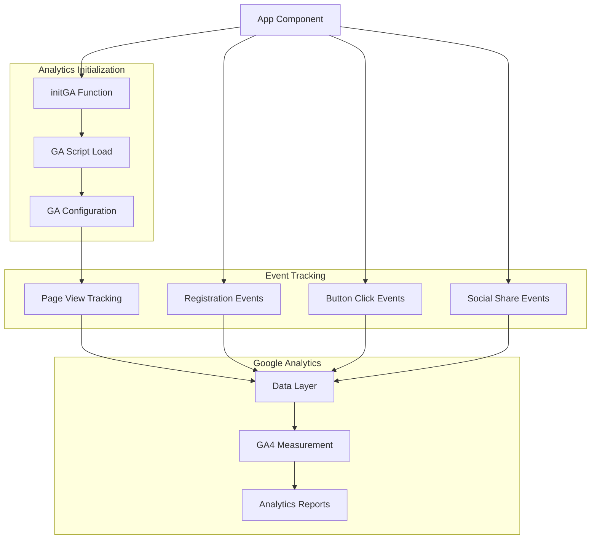
```mermaid
graph TD
    App[App Component]
    
    subgraph "Analytics Initialization"
        Init[initGA Function]
        Script[GA Script Load]
        Config[GA Configuration]
    end
    
    subgraph "Event Tracking"
        PageView[Page View Tracking]
        Registration[Registration Events]
        ButtonClick[Button Click Events]
        SocialShare[Social Share Events]
    end
    
    subgraph "Google Analytics"
        GA4[GA4 Measurement]
        DataLayer[Data Layer]
        Reports[Analytics Reports]
    end
    
    App --> Init
    Init --> Script
    Script --> Config
    Config --> PageView
    
    App --> Registration
    App --> ButtonClick
    App --> SocialShare
    
    PageView --> DataLayer
    Registration --> DataLayer
    ButtonClick --> DataLayer
    SocialShare --> DataLayer
    
    DataLayer --> GA4
    GA4 --> Reports
```

---

## Error Handling Flow

### Error Propagation

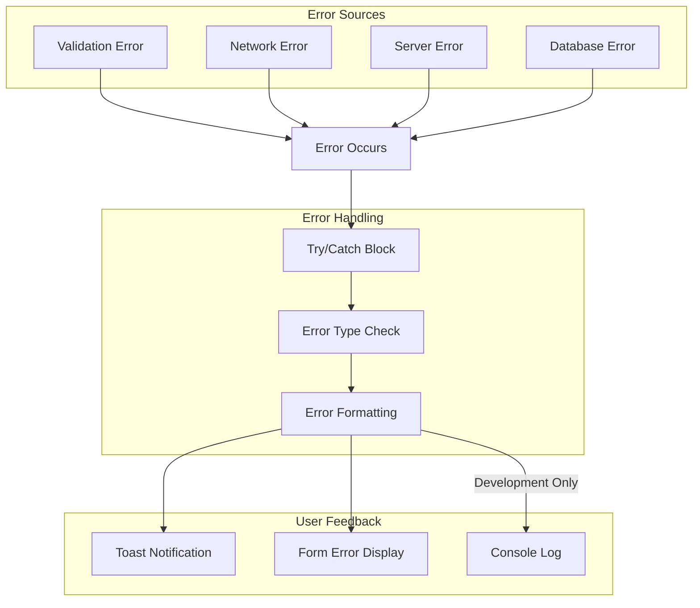
```mermaid
graph TD
    Error[Error Occurs]
    
    subgraph "Error Sources"
        Validation[Validation Error]
        Network[Network Error]
        Server[Server Error]
        Database[Database Error]
    end
    
    subgraph "Error Handling"
        Catch[Try/Catch Block]
        Check[Error Type Check]
        Format[Error Formatting]
    end
    
    subgraph "User Feedback"
        Toast[Toast Notification]
        FormError[Form Error Display]
        Console[Console Log]
    end
    
    Validation --> Error
    Network --> Error
    Server --> Error
    Database --> Error
    
    Error --> Catch
    Catch --> Check
    Check --> Format
    
    Format --> Toast
    Format --> FormError
    Format -->|Development Only| Console
```

---

## API Request Flow

### Complete API Request Cycle

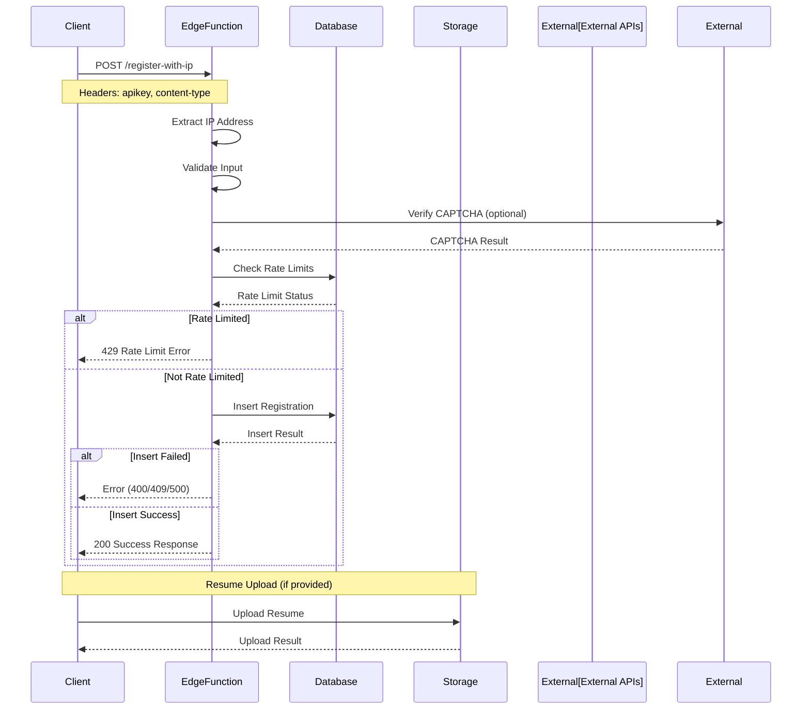
```mermaid
sequenceDiagram
    participant Client
    participant EdgeFunction
    participant Database
    participant Storage
    participant External[External APIs]
    
    Client->>EdgeFunction: POST /register-with-ip
    Note over Client,EdgeFunction: Headers: apikey, content-type
    
    EdgeFunction->>EdgeFunction: Extract IP Address
    EdgeFunction->>EdgeFunction: Validate Input
    EdgeFunction->>External: Verify CAPTCHA (optional)
    External-->>EdgeFunction: CAPTCHA Result
    
    EdgeFunction->>Database: Check Rate Limits
    Database-->>EdgeFunction: Rate Limit Status
    
    alt Rate Limited
        EdgeFunction-->>Client: 429 Rate Limit Error
    else Not Rate Limited
        EdgeFunction->>Database: Insert Registration
        Database-->>EdgeFunction: Insert Result
        
        alt Insert Failed
            EdgeFunction-->>Client: Error (400/409/500)
        else Insert Success
            EdgeFunction-->>Client: 200 Success Response
        end
    end
    
    Note over Client,Storage: Resume Upload (if provided)
    Client->>Storage: Upload Resume
    Storage-->>Client: Upload Result
```

---

## Security Layers Detail

### Defense in Depth

```mermaid
graph TB
    subgraph "Layer 1: Input Validation"
        ClientVal[Client Validation]
        ServerVal[Server Validation]
        DBVal[Database Constraints]
    end
    
    subgraph "Layer 2: Authentication"
        CAPTCHA[reCAPTCHA]
        AdminPass[Admin Password]
        SignedURL[Signed URLs]
    end
    
    subgraph "Layer 3: Rate Limiting"
        ClientRL[Client Rate Limit]
        ServerRL[Server Rate Limit]
        DBRL[Database Rate Limit]
    end
    
    subgraph "Layer 4: Access Control"
        RLS[Row Level Security]
        StoragePolicy[Storage Policies]
        CORS[CORS Policy]
    end
    
    subgraph "Layer 5: Data Protection"
        Encryption[HTTPS/TLS]
        Sanitization[Input Sanitization]
        XSSProtection[XSS Protection]
    end
    
    ClientVal --> ServerVal
    ServerVal --> DBVal
    
    CAPTCHA --> AdminPass
    AdminPass --> SignedURL
    
    ClientRL --> ServerRL
    ServerRL --> DBRL
    
    RLS --> StoragePolicy
    StoragePolicy --> CORS
    
    Encryption --> Sanitization
    Sanitization --> XSSProtection
```

---

## Component Hierarchy

### React Component Tree

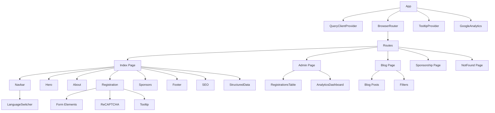
```mermaid
graph TD
    App[App]
    
    App --> QueryProvider[QueryClientProvider]
    App --> Router[BrowserRouter]
    App --> TooltipProvider[TooltipProvider]
    App --> Analytics[GoogleAnalytics]
    
    Router --> Routes[Routes]
    
    Routes --> Index[Index Page]
    Routes --> Blog[Blog Page]
    Routes --> Admin[Admin Page]
    Routes --> Sponsorship[Sponsorship Page]
    Routes --> NotFound[NotFound Page]
    
    Index --> Navbar[Navbar]
    Index --> Hero[Hero]
    Index --> About[About]
    Index --> Registration[Registration]
    Index --> Sponsors[Sponsors]
    Index --> Footer[Footer]
    Index --> SEO[SEO]
    Index --> StructuredData[StructuredData]
    
    Navbar --> LanguageSwitcher[LanguageSwitcher]
    
    Registration --> Form[Form Elements]
    Registration --> ReCAPTCHA[ReCAPTCHA]
    Registration --> Tooltip[Tooltip]
    
    Admin --> RegistrationsTable[RegistrationsTable]
    Admin --> AnalyticsDashboard[AnalyticsDashboard]
    
    Blog --> BlogPosts[Blog Posts]
    Blog --> Filters[Filters]
```

---

## Data Models

### Registration Data Model

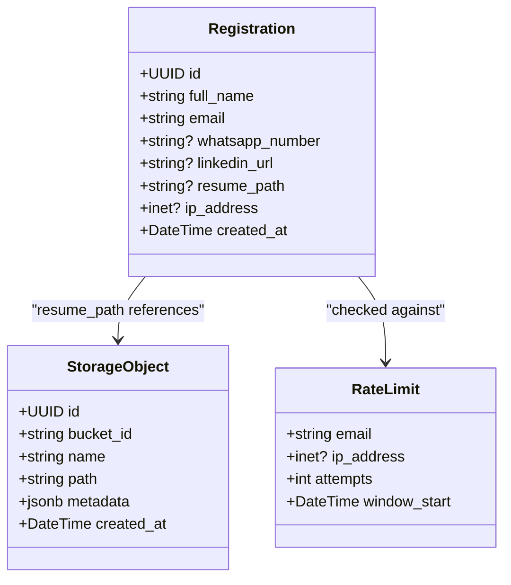
```mermaid
classDiagram
    class Registration {
        +UUID id
        +string full_name
        +string email
        +string? whatsapp_number
        +string? linkedin_url
        +string? resume_path
        +inet? ip_address
        +DateTime created_at
    }
    
    class StorageObject {
        +UUID id
        +string bucket_id
        +string name
        +string path
        +jsonb metadata
        +DateTime created_at
    }
    
    class RateLimit {
        +string email
        +inet? ip_address
        +int attempts
        +DateTime window_start
    }
    
    Registration --> StorageObject : "resume_path references"
    Registration --> RateLimit : "checked against"
```

---

## State Management

### Application State Flow

```mermaid
graph LR
    subgraph "Local State"
        FormState[Form State]
        UIState[UI State]
        ErrorState[Error State]
    end
    
    subgraph "Server State"
        QueryCache[React Query Cache]
        Mutations[Mutations]
    end
    
    subgraph "Persistent State"
        LocalStorage[localStorage]
        SessionStorage[sessionStorage]
    end
    
    FormState --> QueryCache
    UIState --> LocalStorage
    ErrorState --> Mutations
    
    QueryCache --> LocalStorage
    Mutations --> SessionStorage
```

---

## Build Process

### Production Build Flow

```mermaid
graph LR
    Source[Source Code]
    
    subgraph "Build Tools"
        Vite[Vite]
        TypeScript[TypeScript Compiler]
        PostCSS[PostCSS]
        Tailwind[Tailwind CSS]
    end
    
    subgraph "Optimization"
        Minify[JS Minification]
        TreeShake[Tree Shaking]
        CodeSplit[Code Splitting]
        AssetOpt[Asset Optimization]
    end
    
    subgraph "Output"
        JS[JavaScript Bundles]
        CSS[CSS Files]
        Assets[Static Assets]
        HTML[HTML Files]
    end
    
    Source --> Vite
    Vite --> TypeScript
    Vite --> PostCSS
    PostCSS --> Tailwind
    
    TypeScript --> Minify
    Minify --> TreeShake
    TreeShake --> CodeSplit
    
    CodeSplit --> JS
    Tailwind --> CSS
    Vite --> Assets
    Vite --> HTML
```

---

## Testing Architecture

### Test Structure

```mermaid
graph TD
    subgraph "Test Framework"
        Vitest[Vitest]
        RTL[React Testing Library]
        JSDOM[JSDOM]
    end
    
    subgraph "Test Types"
        Unit[Unit Tests]
        Component[Component Tests]
        Integration[Integration Tests]
    end
    
    subgraph "Test Utilities"
        TestUtils[test-utils.tsx]
        Mocks[Mocks]
        Fixtures[Test Fixtures]
    end
    
    Vitest --> Unit
    Vitest --> Component
    Vitest --> Integration
    
    RTL --> Component
    JSDOM --> Component
    
    Component --> TestUtils
    Unit --> Mocks
    Integration --> Fixtures
```

---

## Performance Optimization

### Optimization Strategies

```mermaid
graph TD
    subgraph "Code Optimization"
        CodeSplit[Code Splitting]
        LazyLoad[Lazy Loading]
        TreeShake[Tree Shaking]
        Minify[Minification]
    end
    
    subgraph "Asset Optimization"
        ImageOpt[Image Optimization]
        FontOpt[Font Optimization]
        BundleOpt[Bundle Optimization]
    end
    
    subgraph "Runtime Optimization"
        Memoization[React.memo]
        useMemo[useMemo Hook]
        useCallback[useCallback Hook]
        QueryCache[Query Caching]
    end
    
    subgraph "Network Optimization"
        CDN[CDN Caching]
        Compression[Gzip/Brotli]
        HTTP2[HTTP/2]
        Prefetch[Resource Prefetching]
    end
    
    CodeSplit --> Memoization
    LazyLoad --> useMemo
    TreeShake --> useCallback
    Minify --> QueryCache
    
    ImageOpt --> CDN
    FontOpt --> Compression
    BundleOpt --> HTTP2
    QueryCache --> Prefetch
```

---

## Monitoring & Observability

### Monitoring Architecture

```mermaid
graph LR
    subgraph "Application"
        Frontend[Frontend App]
        EdgeFunctions[Edge Functions]
        Database[(Database)]
    end
    
    subgraph "Analytics"
        GA[Google Analytics]
        Events[Event Tracking]
        PageViews[Page View Tracking]
    end
    
    subgraph "Error Tracking"
        Console[Console Logs]
        SupabaseLogs[Supabase Logs]
        EdgeLogs[Edge Function Logs]
    end
    
    subgraph "Performance"
        Vitals[Web Vitals]
        LoadTime[Load Time]
        APITime[API Response Time]
    end
    
    Frontend --> GA
    Frontend --> Events
    Frontend --> PageViews
    
    Frontend --> Console
    EdgeFunctions --> EdgeLogs
    Database --> SupabaseLogs
    
    Frontend --> Vitals
    Frontend --> LoadTime
    EdgeFunctions --> APITime
```

---

## Network Architecture

### Request Routing

```mermaid
graph TB
    User[User Browser]
    
    subgraph "DNS & CDN"
        DNS[DNS Resolution]
        CDN[CDN Edge]
    end
    
    subgraph "Hosting"
        Host[Hosting Platform]
        Static[Static Files]
    end
    
    subgraph "API Gateway"
        SupabaseAPI[Supabase API]
        EdgeFunctions[Edge Functions]
    end
    
    subgraph "Backend Services"
        Database[(PostgreSQL)]
        Storage[Storage API]
        Auth[Auth API]
    end
    
    User --> DNS
    DNS --> CDN
    CDN --> Host
    Host --> Static
    
    Static --> SupabaseAPI
    SupabaseAPI --> EdgeFunctions
    SupabaseAPI --> Database
    SupabaseAPI --> Storage
    SupabaseAPI --> Auth
```

---

## Future Architecture Considerations

### Scalability Planning

```mermaid
graph TD
    Current[Current Architecture]
    
    subgraph "Future Enhancements"
        Caching[Redis Caching]
        Queue[Message Queue]
        Workers[Background Workers]
        Replication[Database Replication]
    end
    
    subgraph "Microservices"
        AuthService[Auth Service]
        EmailService[Email Service]
        NotificationService[Notification Service]
    end
    
    Current --> Caching
    Current --> Queue
    Current --> Workers
    Current --> Replication
    
    Current --> AuthService
    Current --> EmailService
    Current --> NotificationService
```

---

## Diagram Rendering

These diagrams use **Mermaid** syntax and can be rendered in:

- **GitHub:** Automatically renders Mermaid diagrams
- **GitLab:** Supports Mermaid diagrams
- **VS Code:** With Mermaid extension
- **Documentation Sites:** Many support Mermaid
- **Online:** [Mermaid Live Editor](https://mermaid.live)

### Viewing Diagrams

1. **GitHub/GitLab:** Diagrams render automatically in markdown
2. **VS Code:** Install "Markdown Preview Mermaid Support" extension
3. **Online:** Copy diagram code to [Mermaid Live Editor](https://mermaid.live)

### Exporting Diagrams

To export as images:

1. Use [Mermaid Live Editor](https://mermaid.live)
2. Paste diagram code
3. Export as PNG/SVG
4. Include in documentation

---

**Last Updated:** January 2026  
**Architecture Version:** 1.0.0

